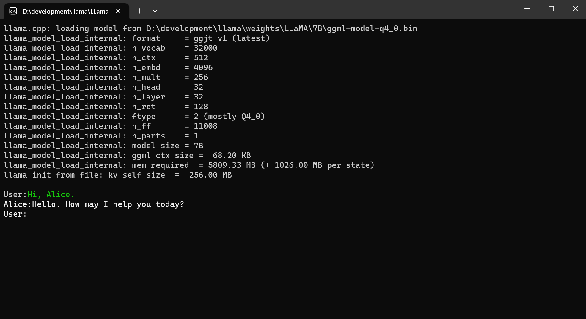

# LlamaSharp - .NET Binding for Llama.cpp


[](https://discord.gg/7wNVU65ZDY)
[](http://qm.qq.com/cgi-bin/qm/qr?_wv=1027&k=sN9VVMwbWjs5L0ATpizKKxOcZdEPMrp8&authKey=RLDw41bLTrEyEgZZi%2FzT4pYk%2BwmEFgFcrhs8ZbkiVY7a4JFckzJefaYNW6Lk4yPX&noverify=0&group_code=985366726)
[](https://www.nuget.org/packages/LlamaSharp)
[](https://www.nuget.org/packages/LlamaSharp.Backend.Cpu)
[](https://www.nuget.org/packages/LlamaSharp.Backend.Cuda11)
[](https://www.nuget.org/packages/LlamaSharp.Backend.Cuda12)


The C#/.NET binding of [Llama.cpp](https://github.com/ggerganov/Llama.cpp). It provides APIs to inference the Llama Models and deploy it on native environment or Web. It works on 
both Windows and Linux and does NOT require compiling Llama.cpp yourself. Its performance is close to Llama.cpp.

- Llama models inference
- APIs for chat session
- Model quantization
- Embedding generation, tokenization and detokenization
- ASP.NET core integration

## Installation

Firstly, search `LlamaSharp` in nuget package manager and install it.

```
PM> Install-Package LlamaSharp
```

Then, search and install one of the following backends:

```
LlamaSharp.Backend.Cpu
LlamaSharp.Backend.Cuda11
LlamaSharp.Backend.Cuda12
```

Here's the mapping of them and corresponding model samples provided by `LlamaSharp`. If you're not sure which model is available for a version, please try our sample model.

| LlamaSharp.Backend | LlamaSharp | Verified Model Resources | Llama.cpp commit id |
| - | - | -- | - |
| - | v0.2.0 | This version is not recommended to use. | - |
| - | v0.2.1 | [WizardLM](https://huggingface.co/TheBloke/wizardLM-7B-GGML/tree/previous_Llama), [Vicuna (filenames with "old")](https://huggingface.co/eachadea/ggml-vicuna-13b-1.1/tree/main) | - |
| v0.2.2 | v0.2.2, v0.2.3 | [WizardLM](https://huggingface.co/TheBloke/wizardLM-7B-GGML/tree/previous_Llama_ggmlv2), [Vicuna (filenames without "old")](https://huggingface.co/eachadea/ggml-vicuna-13b-1.1/tree/main) | 63d2046 |
| v0.3.0 | v0.3.0 | [LlamaSharpSamples v0.3.0](https://huggingface.co/AsakusaRinne/LlamaSharpSamples/tree/v0.3.0), [WizardLM](https://huggingface.co/TheBloke/wizardLM-7B-GGML/tree/main) | 7e4ea5b |

We publish the backend with cpu, cuda11 and cuda12 because they are the most popular ones. If none of them matches, please compile the [Llama.cpp](https://github.com/ggerganov/Llama.cpp)
from source and put the `libLlama` under your project's output path. When building from source, please add `-DBUILD_SHARED_LIBS=ON` to enable the library generation.

## FAQ

1. GPU out of memory: Please try setting `n_gpu_layers` to a smaller number.
2. Unsupported model: `Llama.cpp` is under quick development and often has break changes. Please check the release date of the model and find a suitable version of LlamaSharp to install, or use the model we provide [on huggingface](https://huggingface.co/AsakusaRinne/LlamaSharpSamples).


## Simple Benchmark

Currently it's only a simple benchmark to indicate that the performance of `LlamaSharp` is close to `Llama.cpp`. Experiments run on a computer 
with Intel i7-12700, 3060Ti with 7B model. Note that the benchmark uses `LlamaModel` instead of `LlamaModelV1`. 

#### Windows

- Llama.cpp: 2.98 words / second

- LlamaSharp: 2.94 words / second

## Usages

#### Model Inference and Chat Session

Currently, `LlamaSharp` provides two kinds of model, `LlamaModelV1` and `LlamaModel`. Both of them works but `LlamaModel` is more recommended 
because it provides better alignment with the master branch of [Llama.cpp](https://github.com/ggerganov/Llama.cpp).

Besides, `ChatSession` makes it easier to wrap your own chat bot. The code below is a simple example. For all examples, please refer to 
[Examples](./Llama.Examples).

```cs

var model = new LlamaModel(new LlamaModelSettings(model: "<Your path>", n_ctx: 512, repeat_penalty: 1.0f));
var session = new ChatSession<LlamaModel>(model).WithPromptFile("<Your prompt file path>")
                .WithAntiprompt(new string[] { "User:" });
Console.Write("\nUser:");
while (true)
{
    Console.ForegroundColor = ConsoleColor.Green;
    var question = Console.ReadLine();
    Console.ForegroundColor = ConsoleColor.White;
    var outputs = session.Chat(question); // It's simple to use the chat API.
    foreach (var output in outputs)
    {
        Console.Write(output);
    }
}
```

#### Quantization

The following example shows how to quantize the model. With LlamaSharp you needn't to compile c++ project and run scripts to quantize the model, instead, just run it in C#.

```cs
string srcFilename = "<Your source path>";
string dstFilename = "<Your destination path>";
string ftype = "q4_0";
if(Quantizer.Quantize(srcFileName, dstFilename, ftype))
{
    Console.WriteLine("Quantization succeed!");
}
else
{
    Console.WriteLine("Quantization failed!");
}
```

For more usages, please refer to [Examples](./Llama.Examples).

#### Web API

We provide the integration of ASP.NET core [here](./Llama.WebAPI). Since currently the API is not stable, please clone the repo and use it. In the future we'll publish it on NuGet.

Since we are in short of hands, if you're familiar with ASP.NET core, we'll appreciate it if you would like to help upgrading the Web API integration.

## Demo



## Roadmap

✅ Llama model inference

✅ Embeddings generation, tokenization and detokenization

✅ Chat session

✅ Quantization

✅ State saving and loading

✅ ASP.NET core Integration

🔳 MAUI Integration

🔳 Follow up Llama.cpp and improve performance

## Assets

Some extra model resources could be found below:

- [Qunatized models provided by LlamaSharp Authors](https://huggingface.co/AsakusaRinne/LlamaSharpSamples)
- [eachadea/ggml-vicuna-13b-1.1](https://huggingface.co/eachadea/ggml-vicuna-13b-1.1/tree/main)
- [TheBloke/wizardLM-7B-GGML](https://huggingface.co/TheBloke/wizardLM-7B-GGML)
- Magnet: [magnet:?xt=urn:btih:b8287ebfa04f879b048d4d4404108cf3e8014352&dn=Llama](magnet:?xt=urn:btih:b8287ebfa04f879b048d4d4404108cf3e8014352&dn=Llama)

The weights included in the magnet is exactly the weights from [Facebook Llama](https://github.com/facebookresearch/Llama).

The prompts could be found below:

- [Llama.cpp prompts](https://github.com/ggerganov/Llama.cpp/tree/master/prompts) 
- [ChatGPT_DAN](https://github.com/0xk1h0/ChatGPT_DAN)
- [awesome-chatgpt-prompts](https://github.com/f/awesome-chatgpt-prompts)
- [awesome-chatgpt-prompts-zh](https://github.com/PlexPt/awesome-chatgpt-prompts-zh) (Chinese)

## Contributing

Any contribution is welcomed! You can do one of the followings to help us make `LlamaSharp` better:

- Append a model link that is available for a version. (This is very important!)
- Star and share `LlamaSharp` to let others know it.
- Add a feature or fix a BUG.
- Help to develop Web API and UI integration.
- Just start an issue about the problem you met!

## Contact us

Join our chat on [Discord](https://discord.gg/7wNVU65ZDY).

Join [QQ group](http://qm.qq.com/cgi-bin/qm/qr?_wv=1027&k=sN9VVMwbWjs5L0ATpizKKxOcZdEPMrp8&authKey=RLDw41bLTrEyEgZZi%2FzT4pYk%2BwmEFgFcrhs8ZbkiVY7a4JFckzJefaYNW6Lk4yPX&noverify=0&group_code=985366726)

## License

This project is licensed under the terms of the MIT license.
